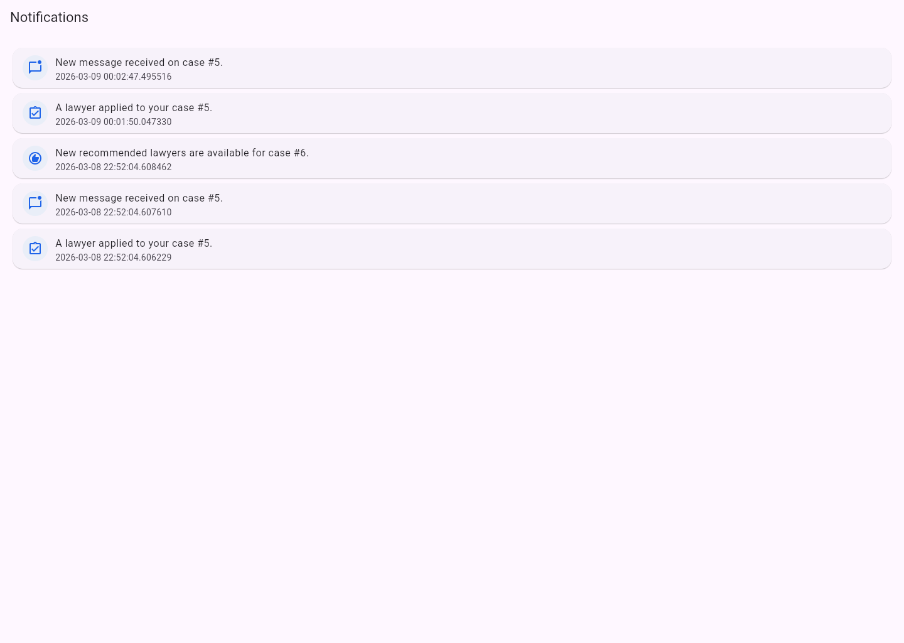

# AdvocateAI

AdvocateAI is an AI-assisted legal marketplace prototype that helps people understand a legal issue, review documents, prepare a case, and connect with relevant lawyers in one flow.

The current build is focused on making the first steps of legal help easier: understanding the problem, organizing the case, and starting communication between clients and lawyers.

## Main Functionality

- AI chat to understand a legal problem in plain language
- AI case analysis with a simple summary, urgency signals, and next-step guidance
- document upload and analysis for PDFs and images
- document batch storage with follow-up question answering over uploaded files
- structured extraction for parties, deadlines, amounts, obligations, and risks
- LangChain-backed prompting with LlamaIndex retrieval for document QA
- legal action guidance for supported common situations
- lawyer recommendations based on the case details
- case creation, case tracking, and case workspace collaboration
- client-lawyer messaging inside the case workspace
- notifications for messages, applications, and recommendations
- separate client and lawyer experiences

## What Clients Can Do

- sign up and log in
- describe a legal problem and get AI guidance
- upload one or more legal documents for analysis
- receive a case summary and intake-readiness insights
- ask follow-up questions against the uploaded document batch
- view suggested lawyers for their issue
- create and manage cases
- keep a lawyer watchlist
- chat with lawyers inside a case workspace
- follow case updates, key dates, and timeline activity

## What Lawyers Can Do

- sign up and manage a lawyer profile
- set availability and maintain profile details
- browse open cases
- view recommended cases
- apply to client cases
- review case details before responding
- message clients in the shared workspace
- track activity through dashboard and notifications

## Current Scope

- the current dataset is centered on Germany-based lawyers and legal flows
- the app already supports an end-to-end prototype experience for discovery, case intake, and lawyer connection
- uploaded document batches are stored for later Q&A and retrieval-based follow-up
- some areas are still early-stage, including payments and long-term production storage workflows

## Screenshots

### Landing Page


### Login Page


### Client Dashboard


### Create Case Page


### Lawyer Dashboard


### Notifications Center


## Quick Start

### Backend

```bash
cd backend
python -m venv venv
venv\Scripts\activate
pip install -r ..\requirements.txt
uvicorn app:app --reload --host 0.0.0.0 --port 8000
```

Create a `.env` file inside `backend/` with the required database and API key settings.

### Frontend

```bash
cd test_app
flutter pub get
flutter run -d chrome
```

## Demo Login

### Client
- Username: `demo_client`
- Password: `demo123`

### Lawyer
- Username: `demo_lawyer`
- Password: `demo123`

## Status

AdvocateAI is currently a working prototype for an AI-assisted legal help and lawyer-matching platform.

## Contact

**contact@visheshsrivastava.com**
