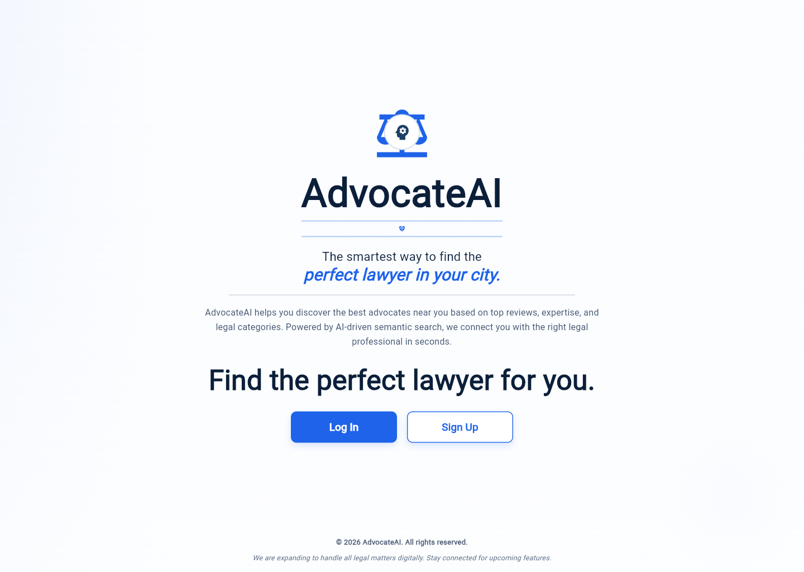
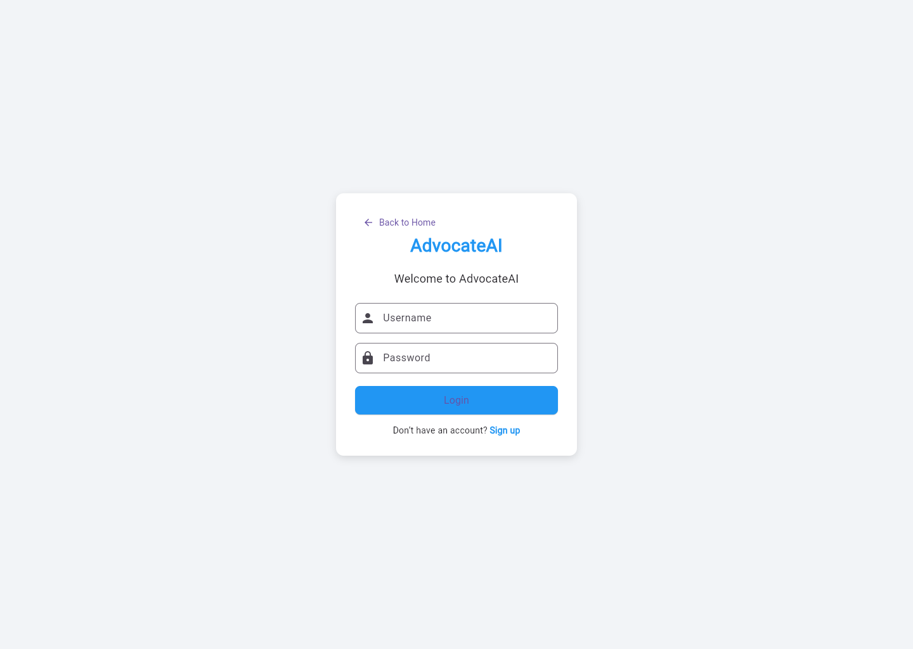
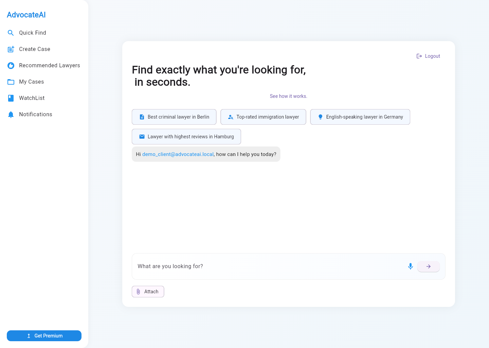
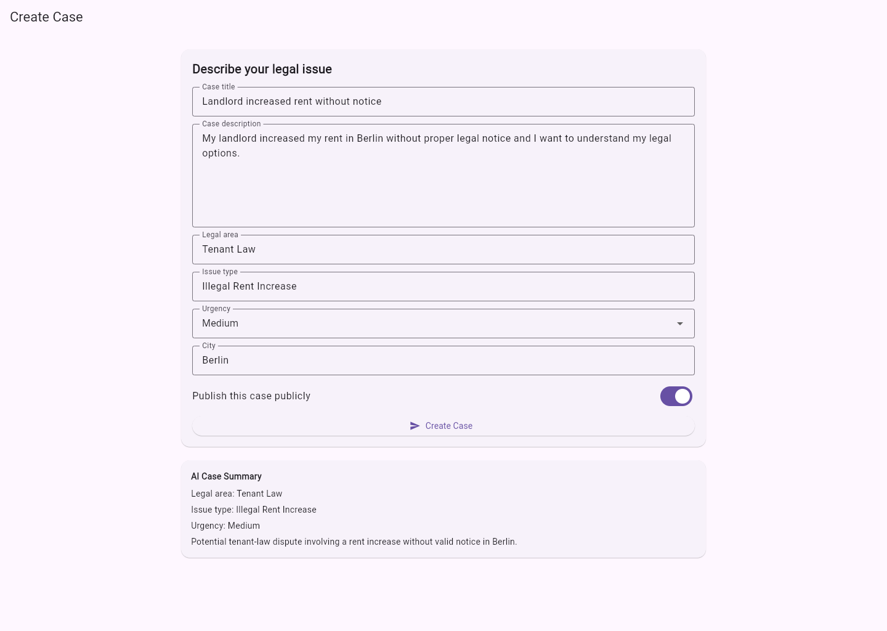
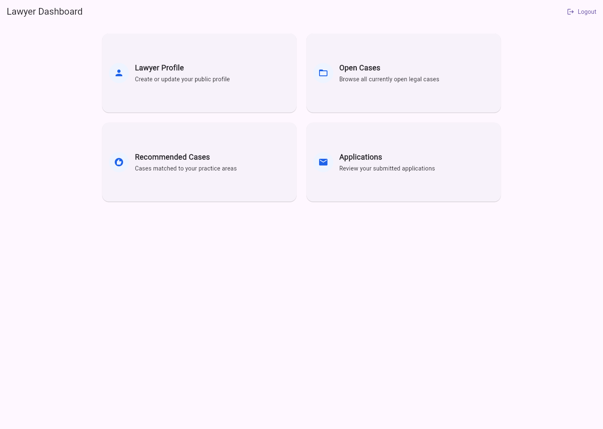

# AdvocateAI

AdvocateAI is an AI-powered legal-tech platform that helps people understand legal problems, analyze legal documents, find relevant lawyers, and move toward consultation through a marketplace-style flow.

It combines:
- AI legal issue detection
- AI document analysis
- lawyer recommendation
- client case creation
- lawyer case discovery and applications

## What the App Does

### For Clients
- sign up and log in
- describe a legal problem in natural language
- get an AI case analysis
- upload a PDF or image document for legal analysis
- find recommended lawyers
- save a problem as a case
- view personal cases
- maintain a lawyer watchlist

### For Lawyers
- create a lawyer profile
- browse open cases
- view recommended cases
- apply to cases
- review submitted applications

## Key Features

- AI chat-based lawyer discovery
- semantic lawyer matching
- role-based client/lawyer flows
- case marketplace workflow
- legal document analysis for PDF and image uploads
- responsive Flutter web UI

## Screenshots

### Landing Page


### Login Page


### Client Dashboard


### Create Case Page


### Lawyer Dashboard


## Tech Stack

- Frontend: Flutter
- Backend: FastAPI
- Database: PostgreSQL
- AI: Gemini API + Sentence Transformers

## Local Run

### Backend

```bash
cd backend
python -m venv venv
venv\Scripts\activate
pip install fastapi uvicorn psycopg2-binary sentence-transformers pydantic python-dotenv requests pdfplumber python-multipart
uvicorn app:app --reload --host 0.0.0.0 --port 8000
```

Create `.env` inside `backend/`:

```env
GEMINI_API_KEY=your_key
GOOGLE_API_KEY=your_key
DB_HOST=localhost
DB_PORT=5432
DB_NAME=postgres
DB_USER=postgres
DB_PASSWORD=postgres
```

### Frontend

```bash
cd test_app
flutter pub get
flutter run -d chrome
```

## Demo Login

### Client
- Username: `demo_client`
- Password: `demo123`

### Lawyer
- Username: `demo_lawyer`
- Password: `demo123`

## Main Capabilities in the Current Build

- signup / login
- persistent session handling
- AI legal issue analysis
- AI document upload analysis
- lawyer recommendations
- watchlist
- case creation and listing
- lawyer profile management
- case applications
- premium pricing UI placeholder

## Current Scope

- current professional dataset is focused on Germany-based lawyers
- the app is structured to scale into a larger legal marketplace
- payments, notifications, messaging, and uploads storage are not fully implemented yet

## Status

AdvocateAI is currently a working prototype / early product foundation for an AI-assisted legal marketplace.

## Contact

**contact@visheshsrivastava.com**
