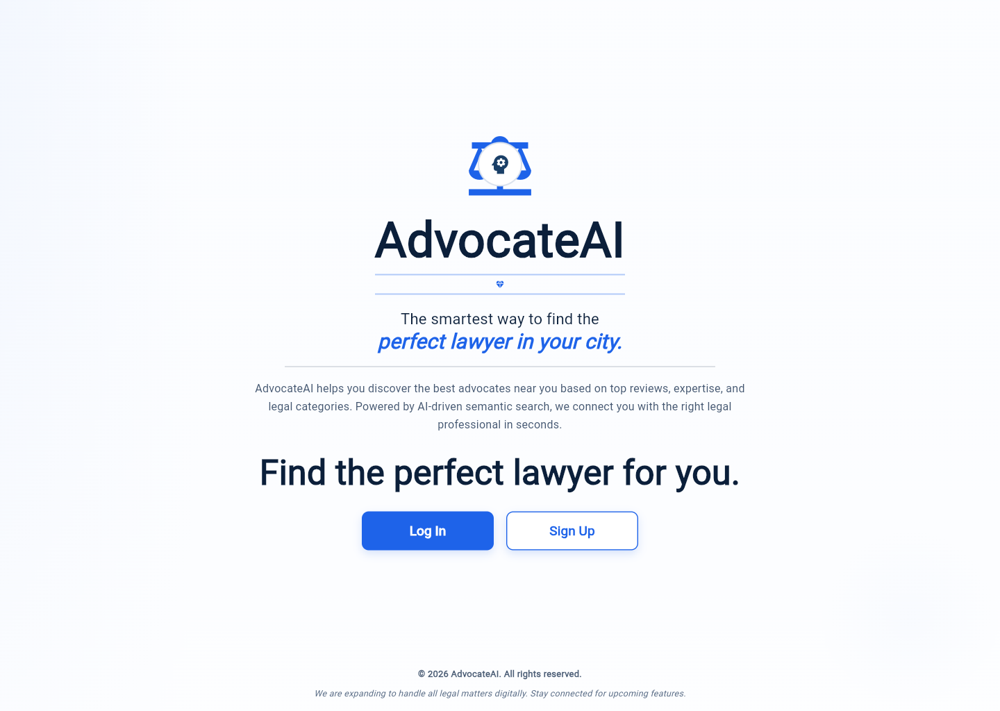
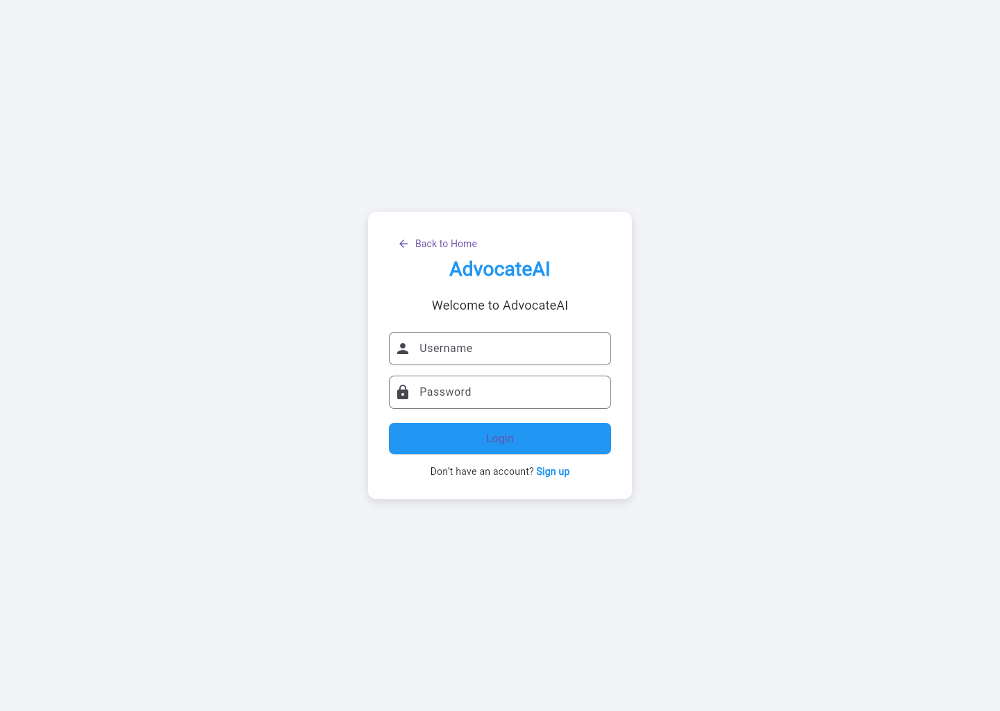
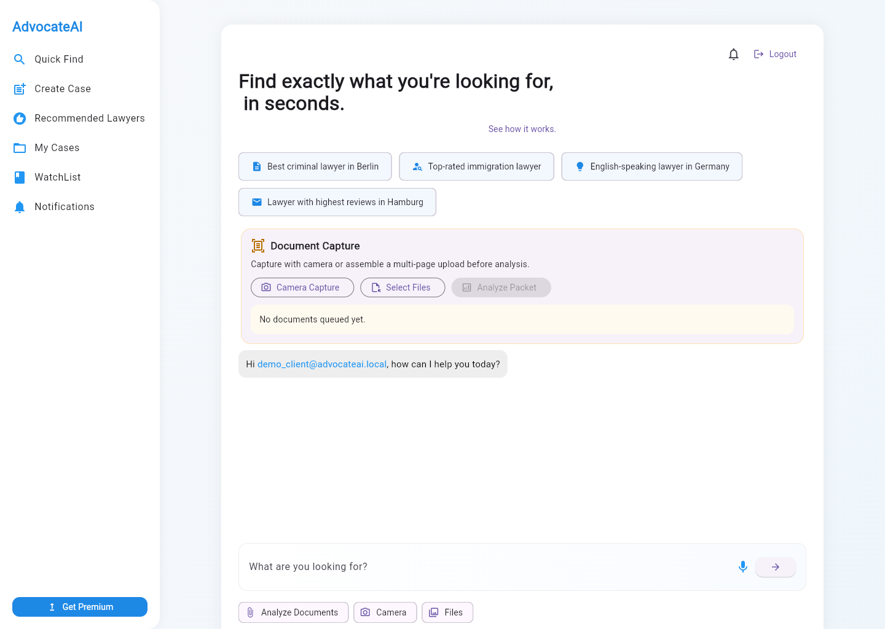
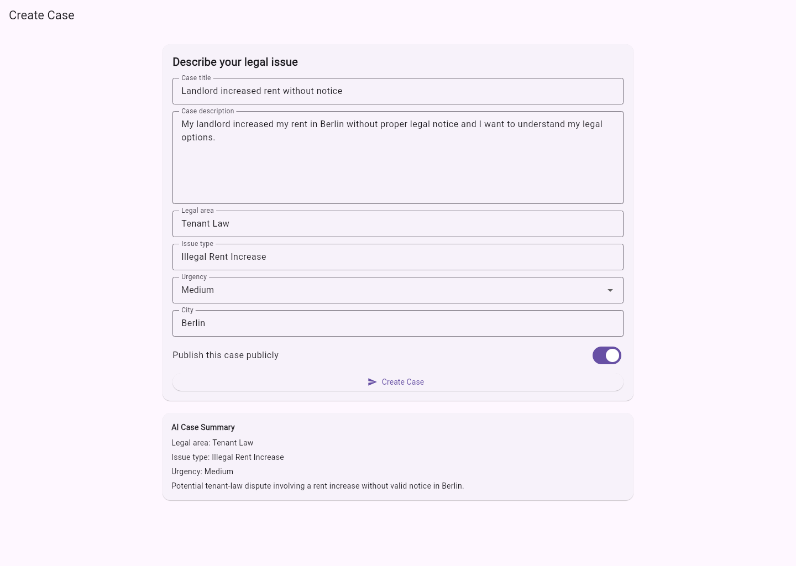
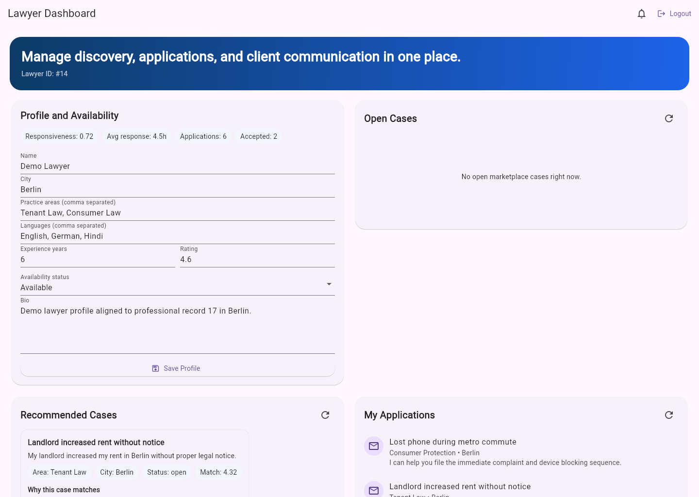
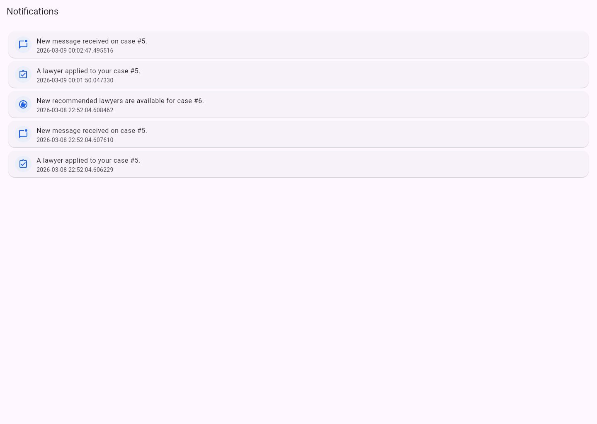

# AdvocateAI

AdvocateAI is an AI-assisted legal marketplace prototype that helps people understand a legal issue, review documents, prepare a case, and connect with relevant lawyers in one flow.

The current build is focused on making the first steps of legal help easier: understanding the problem, organizing the case, and starting communication between clients and lawyers.

## Main Functionality

- AI chat to understand a legal problem in plain language
- AI case analysis with a simple summary, urgency signals, and next-step guidance
- document upload and analysis for PDFs and images
- document batch storage with follow-up question answering over uploaded files
- structured extraction for parties, deadlines, amounts, obligations, and risks
- LangChain-backed prompting with LlamaIndex retrieval for document QA
- legal action guidance for supported common situations
- lawyer recommendations based on the case details
- case creation, case tracking, and case workspace collaboration
- client-lawyer messaging inside the case workspace
- notifications for messages, applications, and recommendations
- separate client and lawyer experiences
- optional MLOps instrumentation for AI runs via Hydra-backed config, MLflow, and Weights & Biases
- optional one-time LoRA/QLoRA fine-tuning script for running adapter training on a GPU server

## Tech Stack

**Backend & APIs:** FastAPI, Python, Uvicorn  
**RAG & Retrieval:** LangChain, LlamaIndex, semantic chunking, retrieval-augmented generation  
**Vector Storage:** FAISS (local similarity search), Qdrant (production vector retrieval), PostgreSQL with pgvector (hybrid relational + vector storage)  
**LLM Provider:** OpenRouter (free-tier models — `openai/gpt-oss-20b:free` for text, `google/gemma-4-31b-it:free` for document image analysis)  
**Fine-Tuning:** Optional LoRA/QLoRA adapter training via `backend/train_lora.py`  
**MLOps:** MLflow experiment tracking, Weights & Biases, Hydra config management  
**Frontend:** Flutter (Dart), Chrome target  
**Infrastructure:** Docker, Git, Linux  

## Architecture Overview

The AI pipeline follows a RAG (Retrieval-Augmented Generation) flow:

1. User uploads a legal document (PDF or image)
2. Document is chunked and converted into vector embeddings
3. Embeddings are stored in a vector store (FAISS locally, Qdrant in production, pgvector for hybrid queries)
4. On user query, relevant chunks are retrieved via semantic similarity search
5. Retrieved context is passed to an LLM (via OpenRouter) with a structured prompt via LangChain/LlamaIndex
6. LLM returns a structured response: case summary, extracted entities, urgency signals, and next-step guidance
7. Optional: LoRA/QLoRA fine-tuning adapters can be trained and wired into the serving path for domain-specific legal language

## What Clients Can Do

- sign up and log in
- describe a legal problem and get AI guidance
- upload one or more legal documents for analysis
- receive a case summary and intake-readiness insights
- ask follow-up questions against the uploaded document batch
- view suggested lawyers for their issue
- create and manage cases
- keep a lawyer watchlist
- chat with lawyers inside a case workspace
- follow case updates, key dates, and timeline activity

## What Lawyers Can Do

- sign up and manage a lawyer profile
- set availability and maintain profile details
- browse open cases
- view recommended cases
- apply to client cases
- review case details before responding
- message clients in the shared workspace
- track activity through dashboard and notifications

## Current Scope

- the current dataset is centered on Germany-based lawyers and legal flows
- the app already supports an end-to-end prototype experience for discovery, case intake, and lawyer connection
- uploaded document batches are stored for later Q&A and retrieval-based follow-up
- some areas are still early-stage, including payments and long-term production storage workflows

## Screenshots

### Landing Page


### Login Page


### Client Dashboard


### Create Case Page


### Lawyer Dashboard


### Notifications Center


## Quick Start

### Backend

```bash
cd backend
python -m venv venv
venv\Scripts\activate
pip install -r ..\requirements.txt
uvicorn app:app --reload --host 0.0.0.0 --port 8000
```

Create a `.env` file inside `backend/` with the required database and API key settings.

Once the backend is running, you can verify service and database readiness at `http://localhost:8000/health`. The root `/` route still returns a lightweight OK response.

Optional MLOps settings:

- `MLOPS_ENABLED=true|false`
- `MLFLOW_ENABLED=true|false`
- `MLFLOW_TRACKING_URI` for a local or remote MLflow server
- `MLFLOW_EXPERIMENT_NAME`
- `WANDB_ENABLED=true|false`
- `WANDB_PROJECT`
- `WANDB_ENTITY`
- `WANDB_MODE` such as `offline` or `disabled`

The default backend config lives in `backend/conf/mlops.yaml`. Tracking is local and non-invasive unless you enable the environment flags above.

### Optional LoRA / QLoRA Fine-Tuning

AdvocateAI now includes a standalone adapter-training script for a one-time GPU run. It is separate from the production backend path, so the app will still use its normal inference flow unless you wire the saved adapter into serving.

Install the extra training dependencies on the GPU server:

```bash
pip install -r requirements-lora.txt
```

Run the training script from the repository root:

```bash
python backend/train_lora.py --dataset path/to/training_data.jsonl --output-dir artifacts/lora_adapter --use-qlora
```

The dataset can be JSON or JSONL and should contain one of these shapes per record:

- `messages` with chat-style `{role, content}` entries
- `prompt` and `response`
- `instruction`, optional `input`, and `output`
- plain `text`

The script saves the adapter under `artifacts/lora_adapter/adapter` and writes a training manifest with the exact settings used. If you want to make the claim that LoRA/QLoRA fine-tuning was done, run this script and keep the saved artifacts or manifest as evidence.

### Frontend

```bash
cd test_app
flutter pub get
flutter run -d chrome
```

## Docker Production Deployment

This repository includes a Docker-based production stack:

- `frontend`: Flutter web served by Nginx, with `/api` proxied to the backend
- `backend`: FastAPI served by Uvicorn
- `db`: PostgreSQL 16
- `redis`: Redis for cache and rate limiting

Create a production env file from the committed example:

```bash
cp .env.example .env.production
```

Fill in the real values, especially `DB_PASSWORD`, `OPENROUTER_API_KEY`, `PUBLIC_APP_URL`, `PUBLIC_API_BASE_URL`, and `CORS_ALLOWED_ORIGINS`.

Run the stack on the server:

```bash
docker compose --env-file .env.production -f docker-compose.prod.yml up -d --build
```

View service status:

```bash
docker compose --env-file .env.production -f docker-compose.prod.yml ps
```

The GitHub Actions pipeline in `.github/workflows/deploy.yml` runs backend tests, validates the Docker Compose config, syncs the repository to the DigitalOcean droplet, writes `.env.production` from GitHub Secrets, and starts the Docker stack.

Required GitHub Secrets:

- `DO_HOST`
- `DO_SSH_KEY`
- `DB_PASSWORD`
- `OPENROUTER_API_KEY`
- `PUBLIC_APP_URL`
- `PUBLIC_API_BASE_URL`
- `CORS_ALLOWED_ORIGINS`

Optional GitHub Secrets:

- `DO_USER` defaults to `root`
- `DO_DEPLOY_PATH` defaults to `/root/AdvocateAI`
- `DB_NAME` defaults to `advocateai`
- `DB_USER` defaults to `advocateai`
- `CORS_ALLOW_ORIGIN_REGEX`
- `LOG_LEVEL`
- `OPENROUTER_MODEL`
- `OPENROUTER_VISION_MODEL`
- `LLM_DEFAULT_TIMEOUT`
- `LLM_ANALYSIS_TIMEOUT`
- `LLM_BRIEF_TIMEOUT`
- `LLM_CHAT_TIMEOUT`
- `LLM_DOCUMENT_TIMEOUT`
- `MLOPS_ENABLED`
- `MLOPS_LOG_PROMPTS`
- `MLFLOW_ENABLED`
- `MLFLOW_TRACKING_URI`
- `MLFLOW_EXPERIMENT_NAME`
- `WANDB_ENABLED`
- `WANDB_PROJECT`
- `WANDB_ENTITY`
- `WANDB_MODE`

## Free-Tier Deployment

The backend can also run entirely on free-tier managed services instead of a DigitalOcean droplet:

- **Backend**: [Render](https://render.com) free web service — configured via [`render.yaml`](render.yaml) (Blueprint). Deploys automatically from `main`.
- **Database**: [Neon](https://neon.tech) serverless Postgres — set `DATABASE_URL` on Render.
- **Cache**: [Upstash](https://upstash.com) serverless Redis — set `REDIS_URL` on Render.
- **LLM**: [OpenRouter](https://openrouter.ai) free-tier models — set `OPENROUTER_API_KEY` on Render.
- **Frontend**: [Cloudflare Pages](https://pages.cloudflare.com), connected to this repo, building `test_app/` with Flutter.

Render's free instance spins down after inactivity (cold start ~30-50s on the next request). Check backend health at `/health`, which reports database and LLM connectivity.

## Demo Login

### Client
- Username: `demo_client`
- Password: `demo123`

### Lawyer
- Username: `demo_lawyer`
- Password: `demo123`

## Status

AdvocateAI is currently a working prototype for an AI-assisted legal help and lawyer-matching platform.

## Contact

**contact@visheshsrivastava.com**
